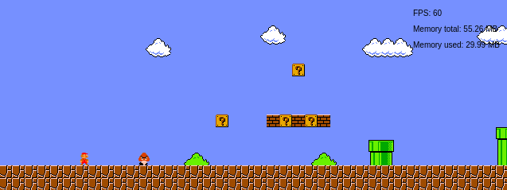

# Super Mario Bros Javascript Clone
A javascript clone of the most popular Nintendo Super Mario Bros game.



## Installation
1. Download ZIP or clone the repository
2. Install assets
```
// Using Yarn
yarn install

// Using NPM
npm install
```
3. Run the game server
```
// Using Yarn
yarn serve

// Using NPM
npm run serve
```
4. Open your browser with URL: http://localhost:8080

## Controls
- Arrow left - move left
- Arrow right - move right
- Arrow up - jump
- Space - turbo

### TODO: bugs, features, performance issues, tech debt, code problems 
- BUG: sometimes game speed slows and comes back after page refresh (probably game loop timing function problems)
- BUG: when mario touch hiding koopa, mario dies at once
- FEATURE: add game over scene
- FEATURE: koopa in panic state should kill another enemies
- FEATURE: win condition with flag jump
- FEATURE: level checkpoints
- FEATURE: walking entities should turns away on when touching
- FEATURE: player lives
- FEATURE: score
- FEATURE: moving to the next level 
- REFACTOR: extract objects generation outside of update() render() functions if they are static (width, vectors, etc)
- FEATURE: add UI layer which should render level time and score (at least always Score: 0)
- FEATURE: add animations distance support and use distance step as arg for frameRate (instead of hardcoded fps)
- REFACTOR: extract all if-statements outside of update() render() functions if they are static
- REFACTOR: move all level load declarations into JSON
- REFACTOR: use object/array destruction with json spec parsing
- REFACTOR: swap console.log alerts on super classes with throwing an errors
- REFACTOR: refactor all references from the component or entity to game scene methods with EventBus pattern 
- REFACTOR: think about replacing all promises with async / await calls
- REFACTOR: double check all config parameters usage & core parameters should be placed inside the engine
- BUG: fix mario physics (bounce power, jumping, etc)
- FEATURE: add render buffer (dont rerender every tick) for static objects (tiles, backgrounds, etc)
- FEATURE: add caching camera view if camera does not change the position (debug on every tick rerender() method)
- BUG: multiple entities overlapping conflict with the player (cannot stomp on them)
